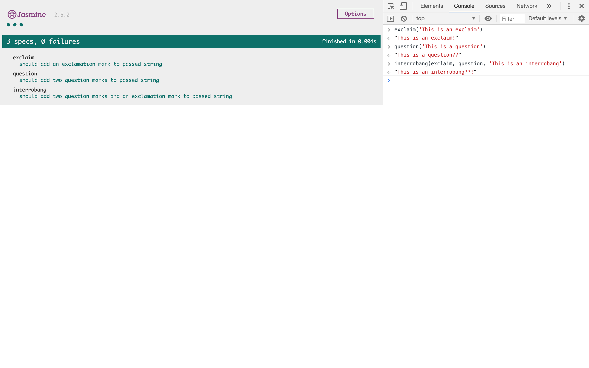

# JavaScript module pattern

This is a small project that shows how the Module Pattern in Javascript works. This simple project shows how you can Encapsulate and share modules in an idiomatic way.

Code can therefore be shared, but only some of the code can be seen/is avaliable, whilst parts of the code are hidden and can not be modified.

## How to Run

Clone this repo, navigate to this directory and right click on the [*SpecRunner*](SpecRunner.html) document and click 'Copy Path'. Cut and paste this link into Google Chrome Web Browser and the JAsmine testing framework will appear shwing 3 passing tests.

Right click, click on 'inspect', then navigate to the 'Console' at the top. 

By typing in the following you can achieve an Interrobang (??!) after any string is input as the third argument. The ability to type the (!) and (??) are set in their own files - [*exclaim*](exclaim.js) and [*question*](question.js) which the file [*interrobang*](interrobang.js) uses in its self titled function.

The functions that dictate the '?' and '!' are hidden in their own files inside a module function, therefore when the function interrobang is called, the only thing the user can modify is the string they supply, it will always be preceeded by '??!'

### Demonstration in the console:

